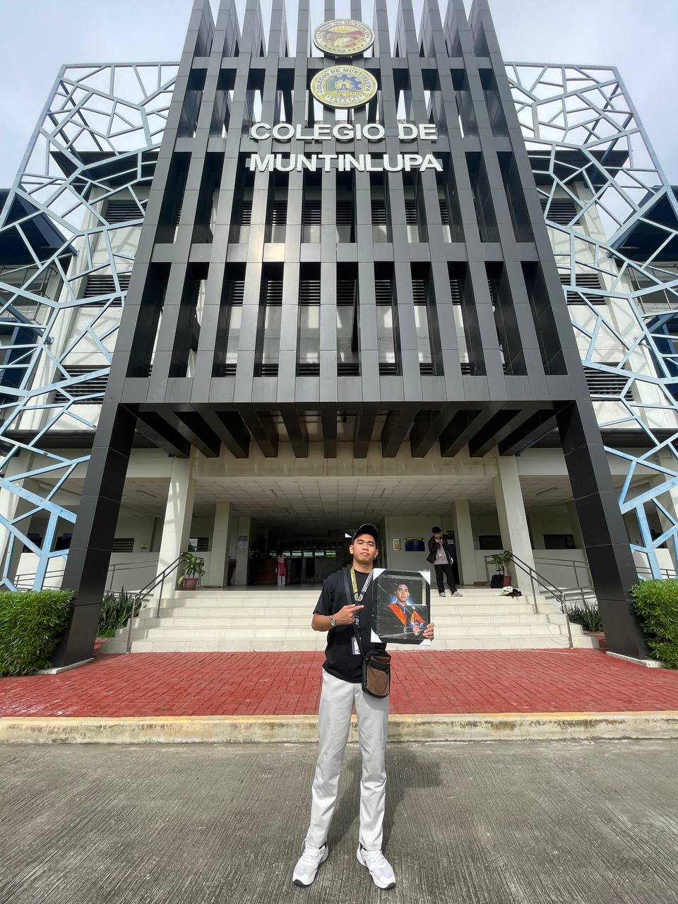

## Hi, I'm Raven 👋

Computer Engineering graduate from **Colegio de Muntinlupa** with **1.5 years of diverse industry experience**.  
Completed **4 internships during college** and secured a **full-time role immediately after graduation**.

---

  

---

### 🚀 Highlights
- 🎓 Computer Engineering Graduate
- 💼 1.5 years industry experience
- 🧪 4 internships during college
- ⚡ Employed right after graduation

---

### 🧭 My Journey
- **2023 – 2024**: Multiple internships while studying Computer Engineering  
  → Web Development, Backend APIs, Systems & Automation  
- **2024**: MIS Student Assistant  
  → Contributed to institutional systems & official school website  
- **2025 – Present**: Software Engineer  
  → Working on real production systems

---

### 🤝 Let’s Connect
- Open to backend, web, and systems engineering roles
- Passionate about building scalable, real-world solutions
